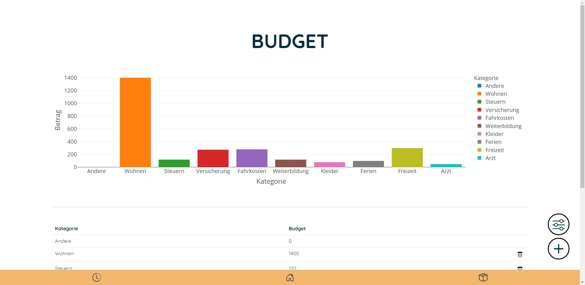
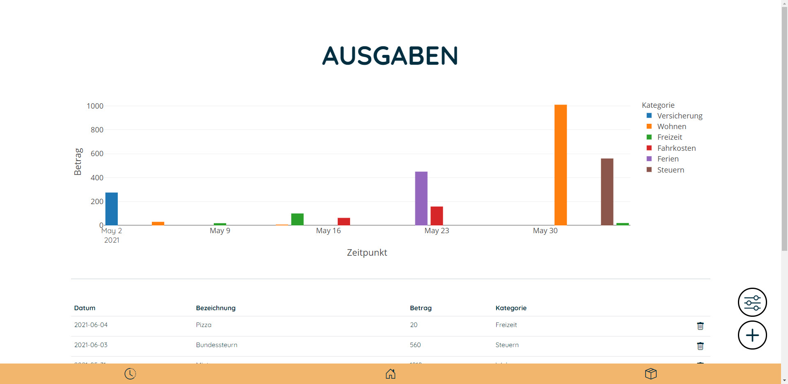
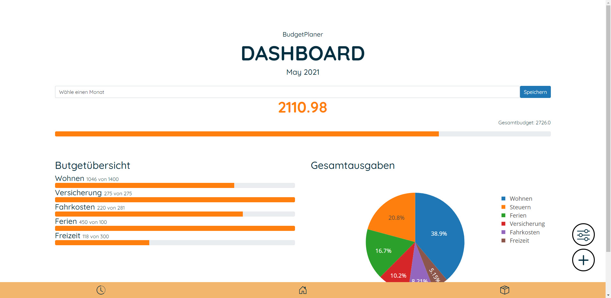

## Ausgangslage
Den Überblick darüber zu behalten wohin der hart erarbeitete Lohn fliesst ist nicht immer 
ganz einfach. Man stellt sich die Fragen:
> *Wohin geht denn mein ganzes Geld?*

`BudgetPlaner` soll dieses Problem lösen, indem man seine Ausgaben und das monatliche 
Budget bequem im Tool eingeben kann. Somit sieht man sofort, für was man wie viel 
Ausgegeben hat und entsprechend auch, ob man sich nun zurückhalten muss, 
oder noch genügen freie Mittel hat. 

## Projektidee
Das Tool soll eine Übersicht über die bereits getätigten Ausgaben inkl. Status des 
jeweiligen Budgets besitzen. Ausserdem sollen die Budgets selbst hinzugefügt, 
und wieder gelöscht werden können.
Das hinzufügen der Ausgaben soll einfach und schnell erfolgen, die vorher definierte 
Budget-Kategorie soll entsprechend ausgewählt werden können.

## Installation
Um `AppName`  starten zu können muss folgendes installiert werden:
- `Python 3.9`
- `Flask`
- `Jinja2`
- `Plotly`
- `Pandas`

Das Tool kann danach von jedem Gerät aus dem Netzwerk über die IP Adresse und Port 5000 aufgerufen werden. 

## Workflow

1. Festlegung der Budget-Kategorien mit Name und entsprechendem Zahlenwert
2. Eingabe der Ausgaben
3. Anzeigen der Ausgaben inkl. Status des jeweiligen Budget

### Dateneingabe
Es sind für die Ausgaben und für die Festlegung der Budget-Kategorien Dateneingaben durch den Nutzer notwendig.
Die Eingabe erfolgt über ein Formular, der Inhalt wird in ein json-File gespeichert.

### Datenverarbeitung/Speicherung
Alle Daten werden in json-Dateien im Ordner `data/` gespeichert. Dabei wird zwischen zwei Dateien unterschieden. Es gibt die `budget.json` und die `ausgaben.json`

##### Budet
Das File `budget.json` enthält folgende Informationen:
- Name der Budget-Kategorie
- Budget in Franken

##### Ausgaben
Im File `ausgaben.json` wird der Zahlenwert der Ausgabe inkl. der zugehörigen Budget-Kategorie gespeichert

### Datenausgabe
Die Eingegebenen Ausgaben bzw. Budget-Kategorien werden direkt 
nach dem Erfassen in der jeweiligen Registerkarte als Liste angezeigt. 

## Benutzeranleitung
Der Nutzer hat die möglichkeit eine neue Budget-Kateogire hinzuzufügen oder zu löschen, sowie eine Ausgabe hinzuzufügen oder zu löschen. 
Ausserdem kann er im Dashboard die Ausgaben je Monat anzeigen lassen. Wie das genau funktioneirt, wird nachfolgende beschrieben.
### Budget hinzufügen
Wenn man nach der Installation das erste mal auf die Seite geht (Startseite), sind noch keine Daten vorhanden, das Dashboard zeigt in diesem Fall keine Daten an.
Man kan nun entweder eine Ausgabe hinzufügen (wenn keine Eigene Budgetkategorie erfasst wurde ist es standardmässig "Andere") oder  zuerst seine Budget-Kategorien hinzufügen.
Dazu wählt man im Menüband unten das Symbol `Budget` aus. Man wird auf die Budgetseite weitergeleitet und 
hat nun die Möglichkeit `Budgetkategorie hinzufügen` anzuwählen. Es öffnet sich ein Eingabeformular wo man 
die Bezeichnung und den Betrag angeben kann.
Beachte, dass wenn man zwei mal den gleichen Namen hinzufügt, es nicht zwei Einträge gibt, sondern dass es dann den ersten Eintrag überschreibt. 

### Ausgabe hinzufügen
Eine neue Ausgabe kann von jeder Unterseite durch das Plussymbol im unteren rechten Bildschirmrand erfassen.
Es öffnet sich ein Eingabeformular wo man den Betrag, die vorher erfasste Budgetkategorie, das Datum sowie die Bezeichnung angeben kann.

### Übersicht über die Ausgaben verschaffen
Auf der Startseite befindet sich das Dashboard, wo man sich einen Überblick über alle in diesem Monat 
getätigten Ausgaben machen kann. Durch Auswahl des gewünschten Monats kann die Ansicht verändert werden (Standardmässig wird der aktuelle Monat angezeigt). 

### Ausgabe oder Budget löschen
Hat man eine Ausgabe oder eine Budgetkategorie falsch erfasst, oder möchte die 
Kategorie ersetzten, hat man die Möglichkeit über das Löschen Symbol (Abfalleimer) den jeweiligen Eintrag zu entfernen.