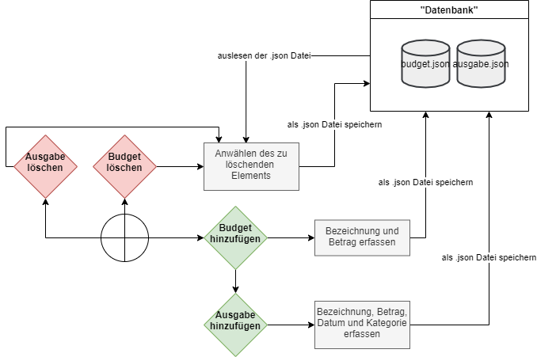
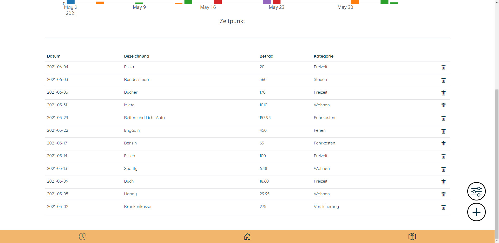

## Ausgangslage
Den Überblick darüber zu behalten, wohin der hart erarbeitete Lohn fliesst, ist nicht immer 
ganz einfach. Man stellt sich die Frage:
> *Wohin geht denn mein ganzes Geld?*

`BudgetPlaner` soll dieses Problem lösen, indem man seine Ausgaben und das monatliche 
Budget bequem im Tool eingeben kann. Somit sieht man sofort, für was man wie viel 
Geld ausgegeben hat und entsprechend auch, ob man sich nun bei weiteren Ausgaben zurückhalten muss 
oder noch genügend freie Mittel hat. 

## Projektidee
Das Tool soll eine Übersicht über die bereits getätigten Ausgaben inkl. Status des 
jeweiligen Budgets beinhalten. Die Budgets sollen selber hinzugefügt und wieder gelöscht werden können.
Das Hinzufügen (und bei Bedarf auch das Löschen) der Ausgaben soll einfach und schnell erfolgen können.

## Installation
Um `BudgetPlaner` starten zu können, muss folgendes installiert werden:
- `Python 3.9`
- `Flask`
- `Jinja2`
- `Plotly`
- `Pandas`

Das gestartete Tool kann danach von jedem Gerät (mit den nötigen Installationen) 
im Netzwerk über die IP-Adresse und den Port 5000 aufgerufen werden. 

## Workflow

### Dateneingabe
Es sind für die Eingabe der Ausgaben und für die Festlegung der Budget-Kategorien 
Dateneingaben durch den Nutzer notwendig.
Die Eingabe erfolgt über ein Formular. Der Inhalt wird in ein json-File gespeichert.

### Datenverarbeitung/Speicherung
Die Daten werden in json-Dateien gespeichert. Dabei wird zwischen zwei Dateien unterschieden. 
Es gibt die Dateien `budget.json` und `ausgabe.json`. Budget-Kategorien werden in der Datei `budget.json`
und Ausgaben in der Datei `ausgabe.json` gespeichert.

##### Budet
Das File `budget.json` enthält folgende Informationen:
- Name der Budget-Kategorie als Key
- Budget (als Zahl)

##### Ausgaben
Das File `ausgabe.json` enthält folgende Informationen:
- Timestamp als Key
- Betrag der Ausgabe
- Dazugehörende Budget-Kategorie
- Manuell festgelegtes Datum der Ausgabe
- Name der Ausgabe

### Datenausgabe
Die eingegebenen Ausgaben bzw. Budget-Kategorien werden direkt 
nach dem Erfassen in der jeweiligen Registerkarte als Tabelle angezeigt 
(Tabelle für Ausgaben und Budget auf den Seiten `/ausgaben/` und `/budget/`). 
Zusätzlich fliessen diese Daten in die insgesamt 4 Diagramme ein (3 Plotly Diagramme und 1 HTML-Diagramm). 
Nachfolgend als Beispiel die Tabelle der Ausgaben.

## Benutzeranleitung
Der Nutzer hat die Möglichkeit, eine neue Budget-Kategorie hinzuzufügen oder zu löschen, 
sowie eine Ausgabe hinzuzufügen oder zu löschen. 
Ausserdem kann er im Dashboard die Ausgaben je Monat anzeigen lassen. 
Wie das genau funktioniert, wird nachfolgend beschrieben.

### Budget hinzufügen
Wenn man nach der Installation das erste Mal das Tool startet (Startseite), sind noch keine Daten 
vorhanden. Das Dashboard zeigt in diesem Fall keine Daten an.
Man kann nun entweder eine Ausgabe hinzufügen (wenn keine eigene Budget-Kategorie erfasst wurde, wird
die Ausgabe standardmässig zu der Kategorie "Andere" hinzugefügt) oder zuerst eigene 
Budget-Kategorien hinzufügen.
Dazu wählt man im rechten Bildschirmbereich das Symbol `Budget hinzufügen` aus. Es öffnet sich ein 
Eingabeformular, in dem man die Bezeichnung und den Betrag angeben kann. Nach dem Speichern wird 
man direkt auf die Seite `Budget` weitergeleitet, wo man die Tabelle aller bisher hinzugefügten 
Budgets sieht (inkl. der Standard-Kategorie "Andere"). Ausserdem sieht man ein Diagramm, 
in dem die Grösse der einzelnen Budgets im Vergleich grafisch dargestellt sind.

Zu beachten: Ein Budget kann bearbeitet werden, in dem ein neues Budget mit dem gleichen Namen wie das
zu bearbeitende Budget angelegt wird. So wird das bestehende Budget mit dem neuen Betrag überschrieben.

### Ausgabe hinzufügen
Eine neue Ausgabe kann von jeder Unterseite durch das Plus-Symbol am unteren rechten Bildschirmrand 
erfasst werden. Es öffnet sich ein Eingabeformular, in dem man den Betrag, die dazugehörende 
Budget-Kategorie, das Datum sowie die Bezeichnung angeben kann.
Das Datum muss manuell ausgewählt werden (anstelle bspw. Timestamp), damit Ausgaben auch rück- 
oder vordatiert werden können.
Nach dem Speichern wird man direkt auf die Seite `Ausgaben` weitergeleitet, auf der man analog 
zur Seite `Budget` die Tabelle aller bisher hinzugefügten Ausgaben sieht. Auch auf dieser Seite
gibt es ein Diagramm, auf dem man die Ausgaben grafisch dargestellt sieht.

Die Tabelle ist nach eingegebenem Datum sortiert.

### Übersicht über die Ausgaben verschaffen
Auf der Startseite befindet sich das Dashboard. Hier kann man sich einen Überblick über alle 
getätigten Ausgaben machen. 
Durch Auswahl des gewünschten Monats (es stehen alle Monate zur Auswahl, in denen eine Ausgabe getätigt wurde)
kann die Ansicht verändert werden. Standardmässig wird der aktuelle Monat angezeigt. 

Somit kann man im Diagramm `Budgetübersicht` pro Monat einsehen, wie viel man bereits pro 
Budget-Kategorie ausgegeben hat.

Das Kreisdiagramm `Gesamtübersicht` zeigt, wie viel Prozent die einzelnen Kategorien an den 
Gesamtausgaben ausmachen (diese Ansicht ändert sich nicht mit dem Wechsel des Monats).
Da es sich um ein plotly express Diagramm handelt, können durch hovern Zusatzinformationen im 
Diagramm abgefragt werden. Auch kann das Diagramm gefiltert werden.

### Ausgabe oder Budget löschen
Hat man eine Ausgabe oder eine Budget-Kategorie falsch erfasst, oder möchte die 
Kategorie löschen, hat man die Möglichkeit, über das Löschen Symbol (Abfalleimer) den 
jeweiligen Eintrag zu entfernen.
Dazu navigiert man auf die jeweilige Registerkarte `/ausgaben/` oder `/budget/` unten im 
Menü und klickt dann beim zu löschenden Eintrag auf den Abfalleimer.
Die Budget-Kategorie "Andere" kann nicht gelöscht werden, da diese als Fallback-Kategorie festgelegt ist.