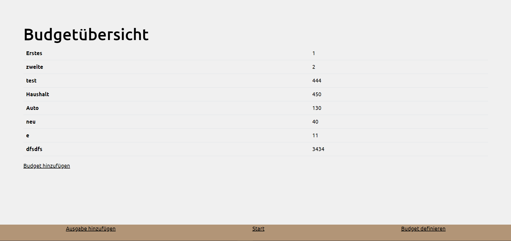
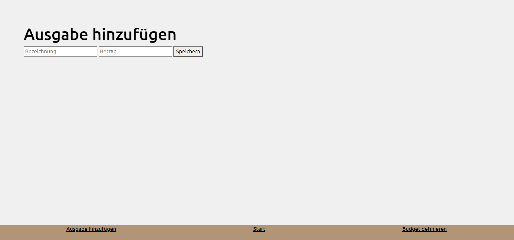
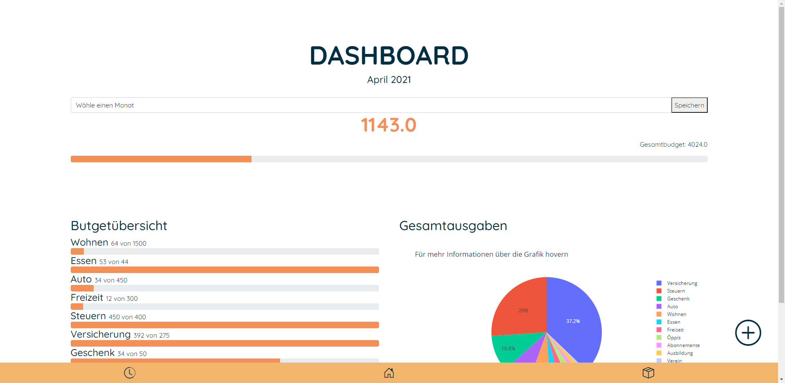

## Ausgangslage
Den Überblick darüber zu behalten wohin der hart erarbeitete Lohn fliesst ist nicht immer 
ganz einfach. Man stellt sich die Fragen:
> *Wohin geht denn mein ganzes Geld?*

`AppName` soll dieses Problem lösen, indem man seine Ausgaben und das monatliche 
Budget bequem im Tool eingeben kann. Somit sieht man sofort, für was man wie viel 
Ausgegeben hat und entsprechend auch, ob man sich nun zurückhalten muss, 
oder noch genügen freie Mittel hat. 

## Projektidee
Das Tool soll eine Übersicht über die bereits getätigten Ausgaben inkl. Status des 
jeweiligen Budgets besitzen. Ausserdem sollen die Budgets selbst hinzugefügt, 
gelöscht und bearbeitet werden können.
Das hinzufügen der Ausgaben soll einfach und schnell erfolgen, die vorher definierte 
Budget-Kategorie soll entsprechend ausgewählt werden können.

## Installation
Um `AppName`  starten zu können muss folgendes installiert werden:
- `Python 3.9`
- `Flask`
- `Jinja2`

Das Tool kann danach von jedem Gerät aus dem Netzwerk über die IP Adresse und Port 5000 aufgerufen werden. 

## Workflow

1. Festlegung der Budget-Kategorien mit Name und entsprechendem Zahlenwert
2. Eingabe der Ausgaben
3. Anzeigen der Ausgaben inkl. Status des jeweiligen Budget

### Dateneingabe
Es sind für die Ausgaben und für die Festlegung der Budget-Kategorien Dateneingaben durch den Nutzer notwendig.
Zum einen für das Festlegen der Budget-Kategorien und zum anderen für das Hinzufügen von Ausgaben.
Die Eingaben werden in einem File auf dem System gespeichert.

### Datenverarbeitung/Speicherung
Alle Daten werden in json-Dateien im Ordner `data/` gespeichert. Dabei wird zwischen zwei Dateien unterschieden. Es gibt die `budget.json` und die `ausgaben.json`

##### Budet
Das File `budget.json` enthält folgende Informationen:
- Name der Budget-Kategorie
- Budget in Franken

##### Ausgaben
Im File `ausgaben.json` wird der Zahlenwert der Ausgabe inkl. der zugehörigen Budget-Kategorie gespeichert

### Datenausgabe
Die Eingegebenen Ausgaben bzw. Budget-Kategorien werden direkt 
nach dem Erfassen in der jeweiligen Registerkarte als Liste angezeigt. 

## Benutzeranleitung
### Budget hinzufügen
Wenn man nach der Installation das erste mal auf die Seite geht, sind noch keine Daten vorhanden.
Man kan entweder eine Ausgabe hinzufügen (ohne Budget) oder  zuerst seine Budget-Kategorien hinzufügen.
Dazu wählt man im Menü `Budget hinzufügen` aus.

### Ausgabe hinzufügen
Im Menü wählt man `Ausgabe hinzufügen` aus um eine neue Ausgabe zu erfassen.

### Übersicht über die Ausgaben verschaffen
Im Menü kann man sich einen Überblick über alle in diesem Monat getätigten Ausgaben machen. 

